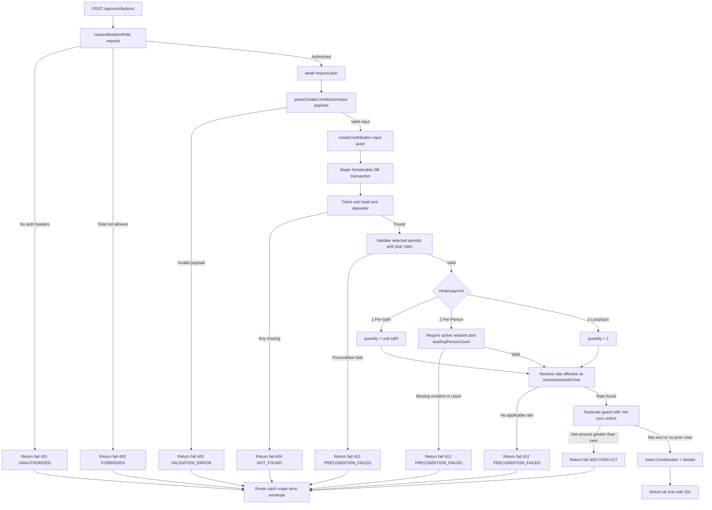

# POST /api/contributions Execution Flow

```mermaid
flowchart TD
    A[POST /api/contributions] --> B[requireMutationRole request]

    B -->|No auth headers| E401[Return fail 401 UNAUTHORIZED]
    B -->|Role not allowed| E403[Return fail 403 FORBIDDEN]
    B -->|Authorized| C[await request.json]

    C --> D[parseCreateContributionInput payload]
    D -->|Invalid payload| E400[Return fail 400 VALIDATION_ERROR]
    D -->|Valid input| S[createContribution input actor]

    S --> T[Begin Serializable DB transaction]
    T --> U[Fetch unit head and depositor]
    U -->|Any missing| E404[Return fail 404 NOT_FOUND]
    U -->|Found| P[Validate selected periods and year rules]

    P -->|Precondition fails| E412A[Return fail 412 PRECONDITION_FAILED]
    P -->|Valid| Q{Head payUnit}

    Q -->|1 Per-SqFt| Q1[quantity = unit sqFt]
    Q -->|2 Per-Person| Q2[Require active resident and availingPersonCount]
    Q -->|3 LumpSum| Q3[quantity = 1]

    Q2 -->|Missing resident or count| E412B[Return fail 412 PRECONDITION_FAILED]
    Q2 -->|Valid| R[Resolve rate effective at transactionDateTime]
    Q1 --> R
    Q3 --> R

    R -->|No applicable rate| E412C[Return fail 412 PRECONDITION_FAILED]
    R -->|Rate found| G[Duplicate guard with net-zero unlock]
    G -->|Net amount greater than zero| E409[Return fail 409 CONFLICT]
    G -->|Net zero or no prior rows| W[Insert Contribution + Details]

    W --> Z[Return ok true with 201]

    E401 --> F[Route catch maps error envelope]
    E403 --> F
    E400 --> F
    E404 --> F
    E409 --> F
    E412A --> F
    E412B --> F
    E412C --> F
```